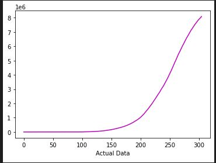
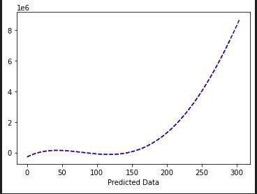
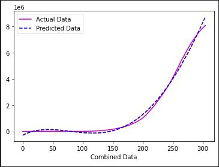

# Coronavirus-Cases-Predictor

Designed a simple cases predictor using linear regression.

## Packages:

Used these pacakges for this project:

- pandas:Used to read dataframes from the dataset.
- numpy: Used to handle the arrays.
- matplotlib: Used to plot the data in graphical format.
- sklearn: Used to do analysis and predict the data in the code.

## Parameters:

Parameter worked on are the cases present.

## Details of the Project:

|Actaul Data  | Predicted Data | Combined Data | Accuracy |
| ------ | -------- | --------------- | ------------------- |
|  |    |       | 99.638      |
